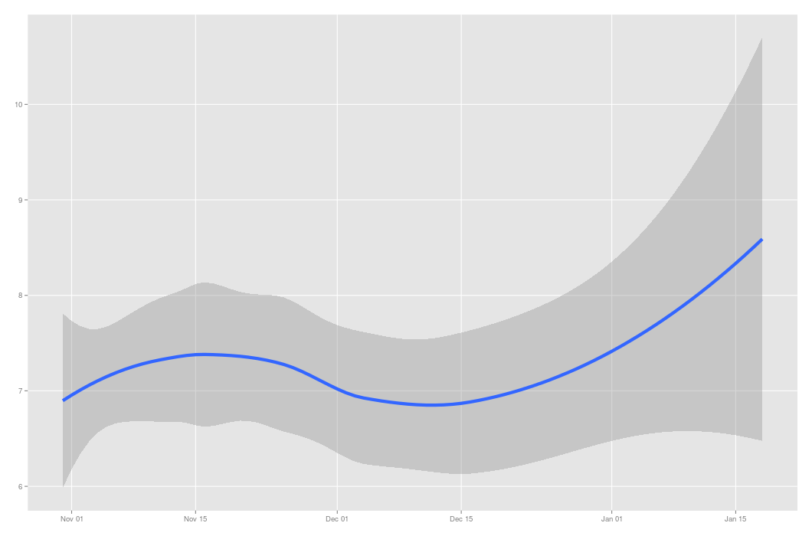
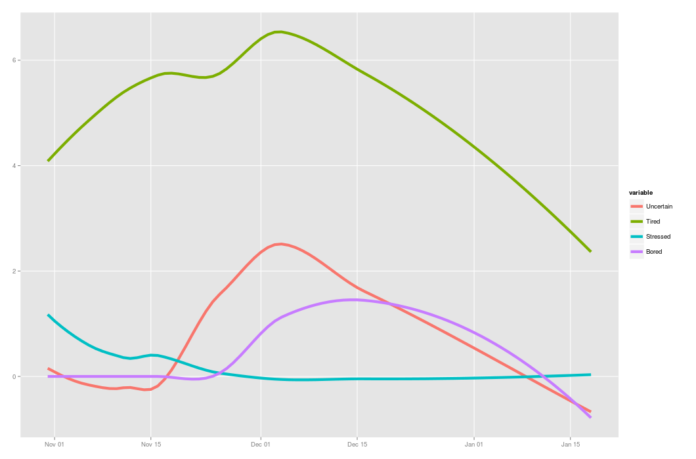
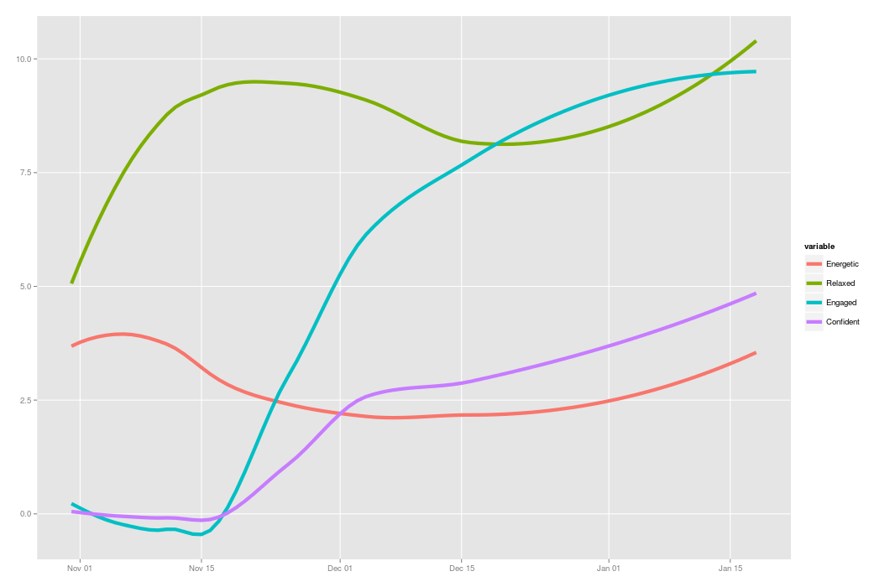
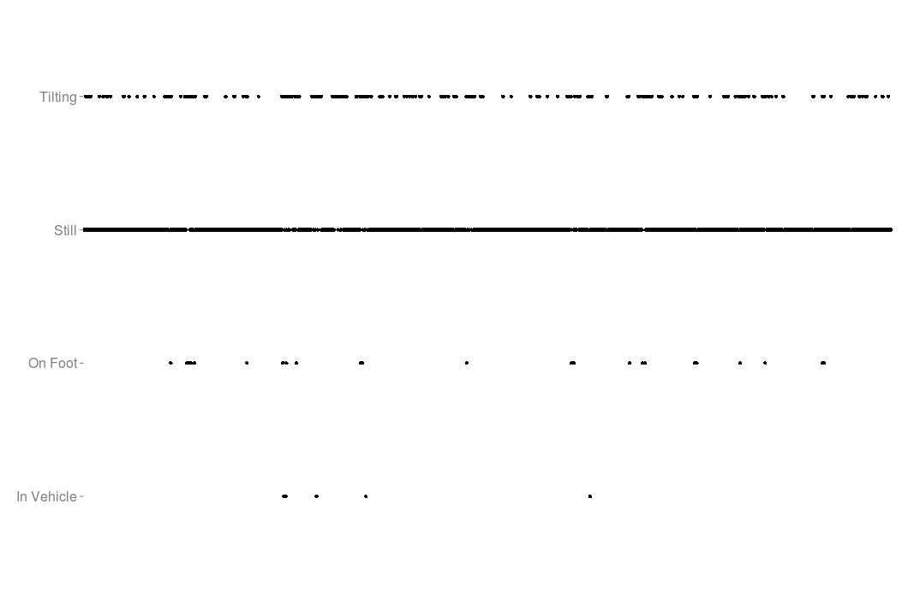
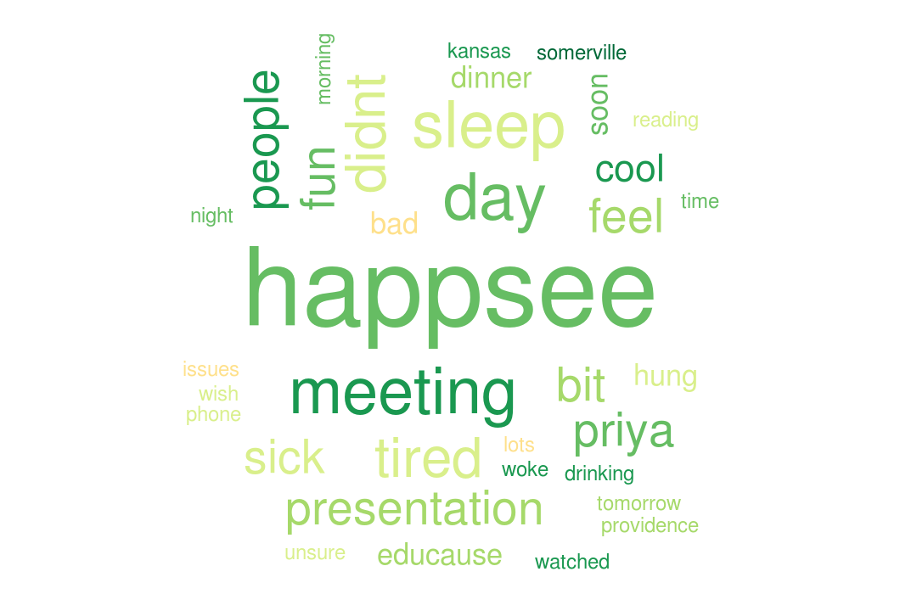
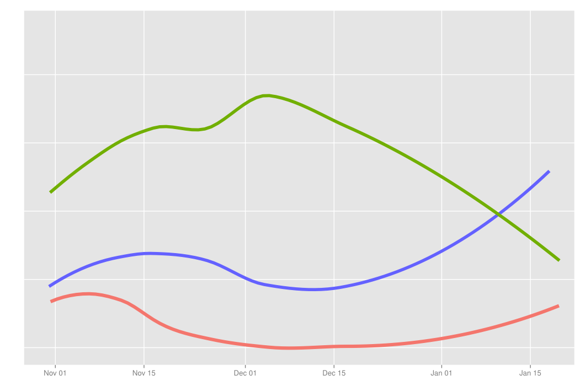

# What can you learn from tracking your own happiness?
## Vik Paruchuri
## vik@equirio.com

---
= data-x="1000" data-y="1000" data-scale="2"

## The most important question

* I was working really long hours.
* Realized that I was unhappy
* Why am I unhappy, and how can it get better?

---
= data-x="2000" data-y="2000" data-scale="1"

## How do we do that?

* Wanted to measure happiness and mood.
* Track passive data to find correlations.
* Make entries when I want (no fixed time)

---
= data-x="3000" data-y="0" data-scale="1"

## What can we use?

* Evaluated lots of measurement tools.
* Some too trivial (measure happiness with a smiley face)
* Others too complex (ask 1000 questions)

---
= data-x="4000" data-y="1000" data-scale="1"

## Create my own tool

* Called happsee(www.happsee.com)
* Works on android
* Maximize information gathered
* Minimize data entry
* Show periodic reminders

---
= data-x="4000" data-y="1000" data-scale="1"

## Some screenshots

---
= data-x="5000" data-y="2000" data-scale="2"

## Have been tracking happiness since October 2013

---
= data-x="6000" data-y="2000" data-scale="2"

## And here is a happiness map

    <link rel="stylesheet" href="http://cdn.leafletjs.com/leaflet-0.6.4/leaflet.css" />
    <link rel="stylesheet" href="css/happiness_map.css"/>

    

    
    
    
    

---
= data-x="7000" data-y="0" data-scale="2"

## Negative moods over time...

---
= data-x="8000" data-y="0" data-scale="2"

## And the positive moods

---
= data-x="9000" data-y="1000" data-scale="1"

## Track passive factors like activity

---
= data-x="10000" data-y="2000" data-scale="2"

## And periodic location

    

    

---
= data-x="11000" data-y="1000" data-scale="1"

## People matter, a lot

---
= data-x="12000" data-y="1000" data-scale="2"

## Being in new circumstances makes me happy

---
= data-x="13000" data-y="2000" data-scale="1"

## Being tired matters more than I thought it does

---
= data-x="14000" data-y="0" data-scale="1"

## What am I thinking for the future?

* Use machine learning to predict happiness
* Apply my own experience from the past to the future
* Do image analysis to figure out emotion

---
= data-x="15000" data-y="0" data-scale="1"

## More future capabilities

* Allow for experience sharing and shared understanding
* Connect to the really important people around me
* Pull in data from other sources

---
= data-x="16000" data-y="1000" data-scale="2"

## Want to try it?

* In beta for android right now.
* Check out happsee.com for more information.
* Contact me at vik@equirio.com

---
= data-x="17000" data-y="0" data-scale="2"

## Thanks for listening!